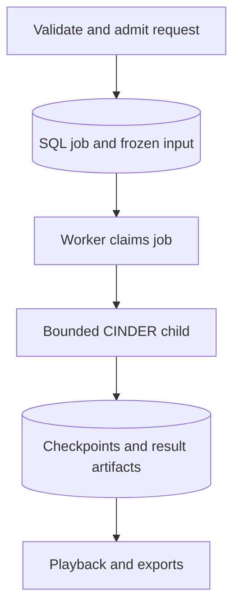

# Backend architecture

The backend connects a browser-facing application to CINDER and durable SQL
storage. Local setup and operational commands are in the
[backend README](../README.md).

## Responsibilities

| Layer | Owns |
| --- | --- |
| CINDER | Model documents, mechanics, validation, simulation/study execution and model result contracts |
| Backend | Sessions and ownership, saved revisions, input composition, job admission/worker lifecycle, artifacts and HTTP errors |
| Frontend | Editing, display units, charts, navigation and scene presentation |

`app/application/cinder_gateway.py` provides the main CINDER boundary. The
specialized fixed-pivot design study also has a CINDER adapter under
`app/engineering/fixed_pivot_primary/`. Routes use application services rather
than constructing a solver. Scene/force projections present resolved geometry and
retained results; presentation meshes are not simulation inputs.

`app/application/container.py` composes the gateway, design-study service and
JSON preset store. SQLAlchemy sessions provide persistent application state;
production runs are not kept in a process-local `RunStore`.

## Authentication and saved content

Registration creates a user and personal account. Browser cookies carry random
session tokens; the database stores their hashes and expiry. Authenticated writes
check a session-derived CSRF token and `X-Cinder-Client: web`. Auth mutations also
check the supplied browser origin. Password changes/reset revoke prior sessions
and reset links. Password-reset mail is delivered by an API background task, not
the simulation worker.

Public readers can inspect saved physical items, tunes, load cases and runs.
Ownership still controls edits, copies into a user's workspace, submissions and
cancellation. Public authorship excludes credentials and email addresses.
Physical items and experiments have immutable revisions. A run uses the chosen
revisions and explicit temporary overrides; subsequent edits do not mutate it.

## Simulation lifecycle

`app/application/jobs.py` admits requests into the database queue. Submission
requires an idempotency key and permits one queued/running job per account.
The same key and payload return the accepted job; a changed payload conflicts.
Preflight is synchronous, but integration occurs only in the worker's child.
Experiment, legacy library, direct/debug and validation simulation submissions
share this queue. Static engineering studies are separate synchronous requests.

`app/scripts/run_worker.py` claims work with a worker token and launches
`run_child.py`. Deadlines, memory and result-size limits bound the child. Writes
are fenced by the worker token so an obsolete worker cannot replace newer state.
Cancellation stops/reaps the child before releasing its active slot. Deadline
recovery handles orphaned jobs; retries are explicit new runs.

The child advances CINDER in accepted chunks and writes checkpoints. The parent
stores the latest valid result and preview together. Failed, timed-out or
cancelled runs may therefore retain playable partial data. Checkpoints do not
resume an interrupted solver. Reruns freeze the original input into a new job
and record the installed execution identity. A worker whose runtime differs from
the submitted identity fails rather than silently relabeling results.

`run_outcomes.py` separates execution status from the simulated course outcome
and the reason a run stopped. It derives saved progress from retained finite
samples. Errors annotate existing checkpoints and preserve their data even
when the final result cannot be stored. The child returns a safe error envelope
with a nonzero exit; the worker reads that envelope before classifying the exit.
Missing or unreadable completion output never turns a checkpoint into success.

New jobs do not look up the legacy global run cache. Existing cache-linked
artifacts remain readable. See [DATABASE.md](DATABASE.md) for persisted fields.

## Contracts and previews

Runtime identity separates the CINDER package version, input schema version and
result contract version, plus the backend execution policy and default secondary
helix topology. Ordinary runs use zero-clearance slotted support; native CINDER
documents can explicitly select unilateral hardware. Keep these identities and
the frozen input distinct in stored provenance.
`app/scripts/export_contract_artifacts.py` exports backend OpenAPI and CINDER's
assembly/input/result JSON schemas. Frontend types are generated from those
artifacts; generated files are not committed.

Tune editing uses sampled contact and geometry projections for responsiveness.
A complete preview allows Save to be attempted; it does not establish that the
full construction audit has passed. Saving and run admission perform independent
validation. Stale or incomplete previews must not validate an edited draft.
Per-tip scene mass metadata is optional: unsupported distributions and older
recordings retain the fallback illustration without inventing an inferred mass.
