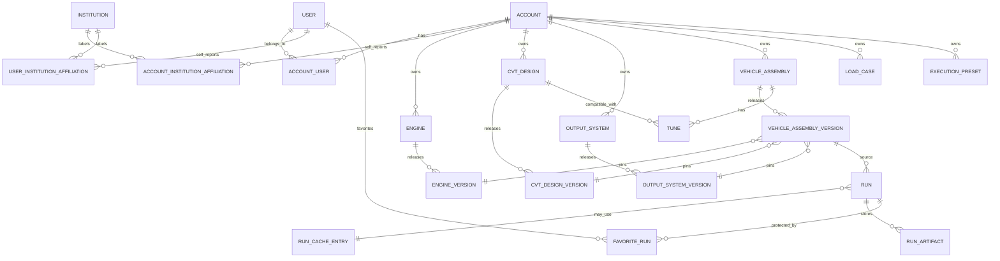

# Database model

The database stores editable, versioned design objects that resolve into a full
CINDER simulation document. Library/object-management endpoints use these
tables, and `POST /api/v1/runs/from-library` resolves released versions into a
frozen CINDER contract, executes it, caches the result, and persists the run.
The direct `POST /api/v1/runs` endpoint remains available only for
debug/contract comparisons. Product flows should submit through
`POST /api/v1/runs/from-library` and rerun old persisted runs through
`POST /api/v1/runs/{run_id}/rerun`.

## ER sketch



## Core invariants

- Mutable objects may have drafts.
- Only released versions should be referenced by assemblies, gallery flows, and runs.
- Released versions are immutable.
- Runs store a frozen resolved `input_contract` and do not depend on later edits.
- Mutable design objects carry lifecycle/catalog metadata for selectors and galleries.
- Released versions carry payload schema and validation metadata for stale/deprecated handling.
- CVT hardware owns only CVT inertias.
- Input boundary owns engine/input inertia.
- Output boundary owns vehicle, gearbox/final-drive, road-load defaults, and direct secondary-shaft inertia.

## CINDER mapping

```text
EngineVersion.input_boundary                  -> simulation_case.input_boundary
CVTDesignVersion.cinder_assembly              -> simulation_case.assembly
OutputSystemVersion.output_boundary_template  -> simulation_case.output_boundary
LoadCase.payload.scenario                     -> simulation_case.scenario
LoadCase.payload.output_boundary_overrides    -> merge into output_boundary
ExecutionPreset.payload                       -> simulation_case.execution
```

`app.database.resolver.resolve_simulation_case` performs that composition and
returns a JSON-safe document with a stable `contract_hash`. The contract hash is
based on the executable CINDER subset (`assembly`, `input_boundary`,
`output_boundary`, `scenario`, and `execution`) so different database IDs for the
same physics can still share a run cache entry.

## Future-proofing points

`OutputSystemVersion.output_boundary_template` has a `drivetrain_loss_model`
slot. V1 seeds it as:

```json
{"kind": "none"}
```

Later CINDER can support:

```json
{"kind": "constant_efficiency", "efficiency": 0.95}
```

or a ratio/torque/speed map without moving gearbox data into the CVT design.

Institution data is intentionally separate from account tier/subscription data.
V1 uses self-reported affiliations only.


## Relational shell + JSONB model body

Buildable objects are tables because they need identity, ownership, visibility,
drafts, defaults, catalog priority, and released-version pointers. Their released
physics/model payloads are JSONB on PostgreSQL because the internal shape is
expected to evolve. For example, an engine version can start as:

```json
{"kind": "full_throttle_torque_curve", "points": []}
```

and later gain a throttle map without changing the `engines` table:

```json
{"kind": "throttle_torque_map", "speed_axis_rad_per_s": [], "throttle_axis": [], "torque_grid_Nm": []}
```

The current payload columns use `app.database.types.JsonPayload`, which maps to
PostgreSQL `JSONB` and SQLite `JSON`. Version payloads and load-case payloads
also declare PostgreSQL GIN indexes for future gallery/search filters.

## Catalog and lifecycle metadata

The buildable object tables (`engines`, `cvt_designs`, `output_systems`, and
`vehicle_assemblies`) include:

```text
lifecycle_status  active | deprecated | archived
catalog_status    user_created | official | ots_part | seeded_example | admin_curated | community
catalog_priority  higher appears earlier in selectors
is_default        useful for onboarding/default pickers
source_label/source_url/source_notes optional provenance text
```

No manufacturer table is included in V1. Commercial/OTS provenance can be stored
with `source_label` and `source_notes` until there is a real need for a separate
catalog table.

Released version tables include:

```text
payload_schema_name
payload_schema_version
validation_status     valid | needs_migration | deprecated | unsupported | invalid
validation_messages
superseded_by_version_id
deprecated_at
```

The resolver keeps old but valid/deprecated versions runnable and returns
`database_resolution.version_warnings`. Versions marked `invalid` or
`unsupported` are blocked before a CINDER document is produced. Old runs remain
reproducible because they already store the full frozen `Run.input_contract`.

## Library endpoint lifecycle

The library API exposes database-backed object management. The supported
lifecycle is:

```text
create mutable object
update draft payload / catalog metadata
release immutable version
fork a released version into a new draft object
deprecate or supersede old versions
archive/deprecate mutable objects for selectors
```

Non-versioned support objects are also exposed for `tunes`, `load-cases`,
`execution-presets`, and seeded `institutions`.

## Persisted library runs

`POST /api/v1/runs/from-library` accepts released object IDs instead of a full
contract:

```text
vehicle_assembly_version_id
tune_id optional
load_case_id optional
execution_preset_id optional
```

The backend resolves those IDs, validates the resulting CINDER simulation case,
computes a stable executable-contract hash, checks `run_cache_entries`, and then
either reuses the cached result or runs CINDER. Every persisted run stores:

```text
input_contract        frozen resolved simulation case
contract_hash         executable physics hash
summary_scalars       metrics, summary, warnings, transitions
summary_series        current default durable preview payload
run_artifacts         preview_series plus evictable full_result artifacts
```

The full-result artifact currently uses `storage_backend = inline_json`. That is
intentionally simple for V1 and can later become S3/R2/local-file storage without
changing the run table shape. Full-result artifacts are marked evictable. The
`preview_series` artifact is not evictable by default and is also copied into
`runs.summary_series` so old runs can still show summary stats and key plots even
when the full trace has been removed. `GET /api/v1/runs/{run_id}/input` returns
the frozen contract for inspection/debugging, `GET /api/v1/runs/{run_id}/preview`
returns the versioned chart-ready preview, and `POST /api/v1/runs/{run_id}/rerun`
creates a new persisted run from the old frozen input without re-resolving live
library objects.

Preview payloads are profile-versioned. The current profile is
`default_run_preview` v1 using uniform endpoint-preserving downsampling with a
500-point cap. Future runs can use a new profile with different fields or point
limits without mutating old previews. The direct-contract run endpoint remains
useful for optional developer comparisons, but it is not part of required
black-box product acceptance.

The broad smoke script `python -m app.scripts.smoke_library_database` exercises
object lifecycle, library-run execution, result retrieval, preview generation,
cache reuse, persisted reruns from frozen input, full-result eviction,
rerun-after-eviction, and persisted run/artifact/cache rows against a temporary
database.
